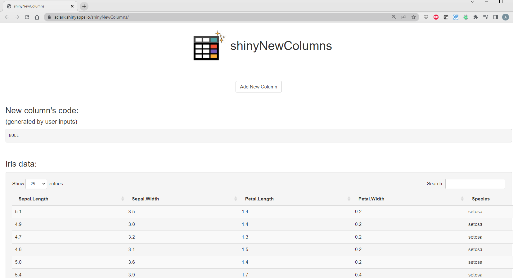
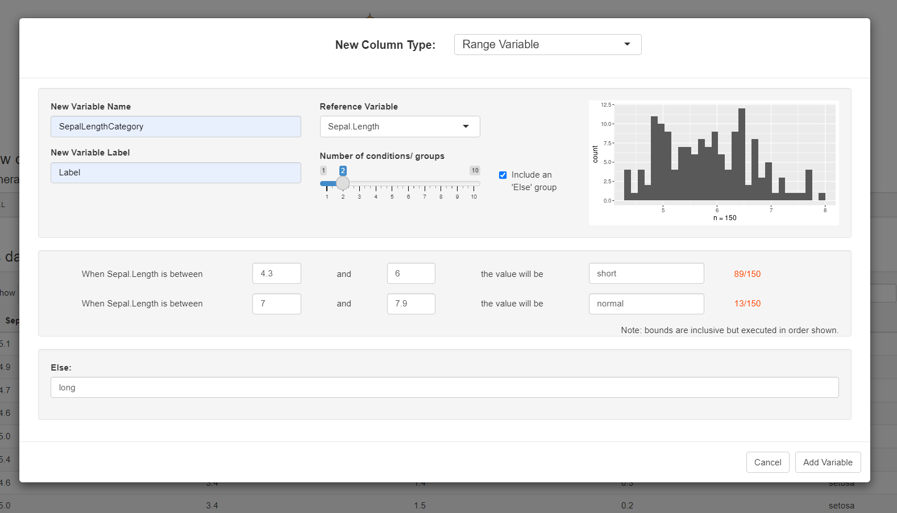
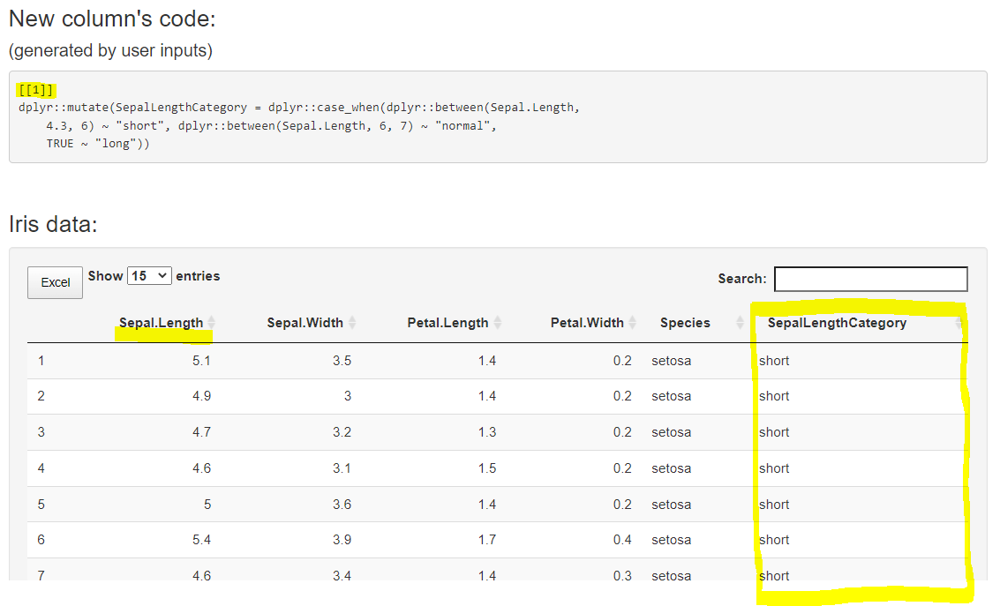
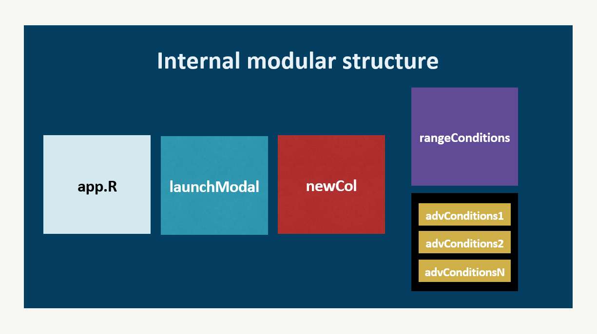
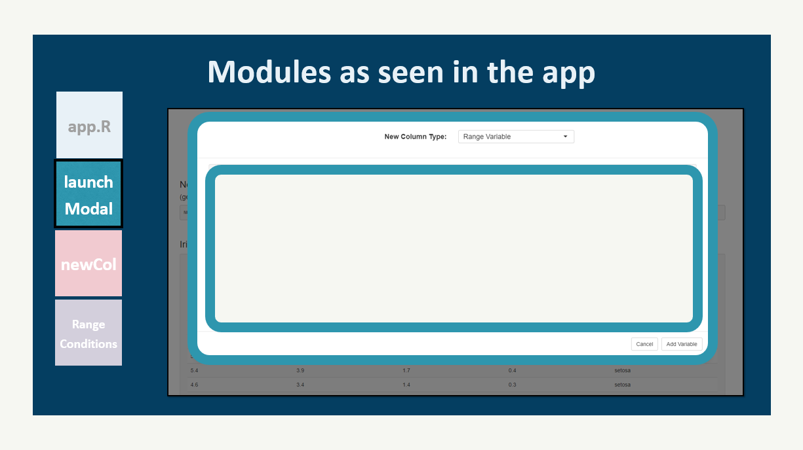
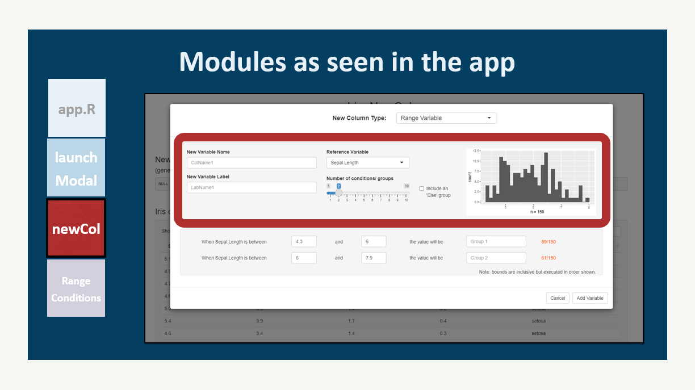
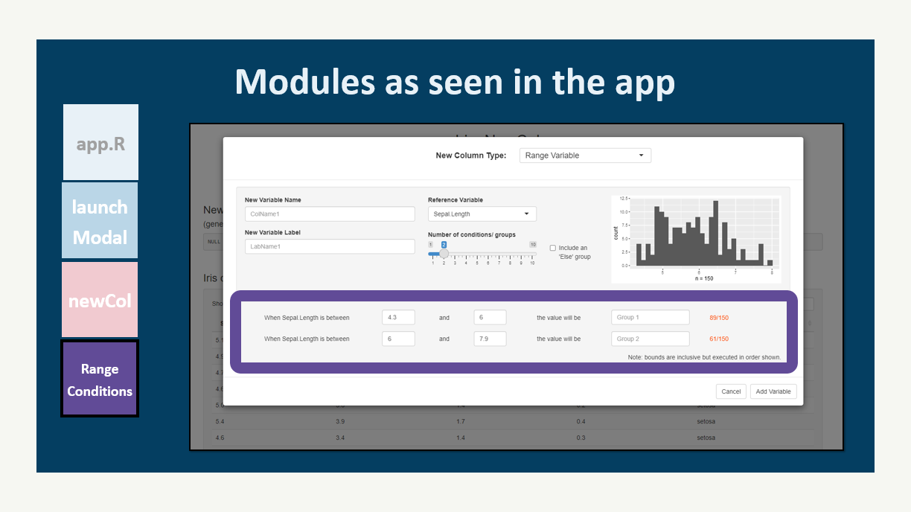
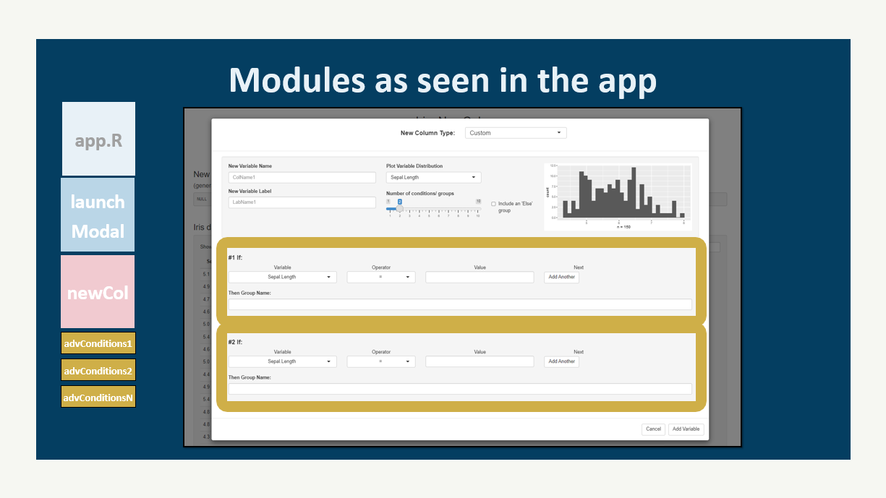
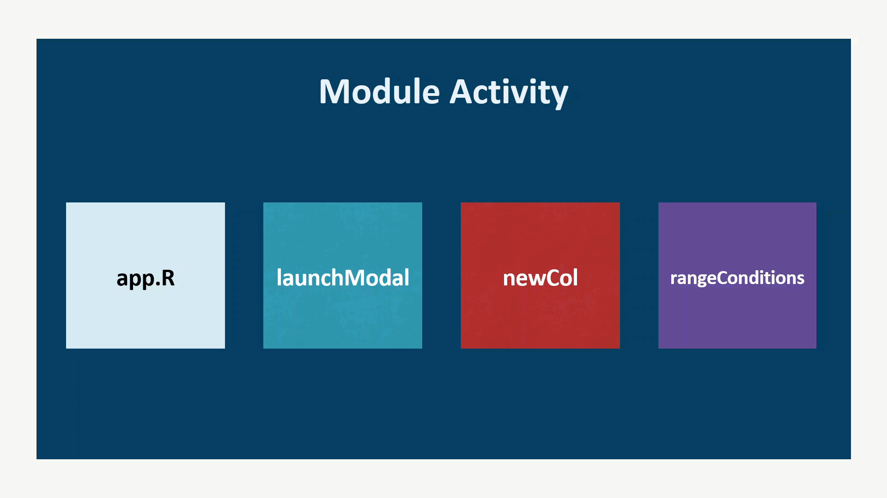

<!-- README.md is generated from README.Rmd. Please edit that file -->

# shinyNewColumns <a href='https://github.com/AARON-CLARK/shinyNewColumns'></a>

<!-- badges: start -->

[](https://lifecycle.r-lib.org/articles/stages.html#experimental)

<!-- badges: end -->

`shinyNewColumns` is a shiny module used to derive custom columns in R
data.frames on the fly. The module simply produces one small UI element:
an action button titled ‘Create New Column’ that can be placed anywhere
in an existing shiny application. Upon clicking, a modal containing a
user-friendly interface will launch & allow the user to build a new
column off an existing data source. Specifically, the user will be able
to define a new column name, type, & label using reference column(s) as
a basis to populate it’s values. Along the way, the module provides
simple summaries & visuals of existing column’s distributions. When
satisfied, the user can click ‘Add variable’ and the module returns the
user supplied data.frame with the new column appended PLUS the
`dplyr::mutate()` expressions used to generate it.

Click the `DEMO APPP` button below to launch an example app which
leverages the `shinyNewColumns` module to create new columns in the
popular `iris` data.frame. The app’s code is provided below as well.
What are you waiting for? Go empower your users to make more columns!

<center>
<a href="https://bit.ly/shinynewcolumns">

</a>
</center>

<br>

## Shiny Conf 2022

The `shinyNewColumns` shiny module was featured as a tutorial for the
first annual Appsilon Shiny Conference in April of 2022. The subject of
the tutorial was on “**Evaluating user inputs from dynamically produced
UI modules**”. With time, Appsilon will post the tutorial’s recording to
their
[YouTube](https://www.youtube.com/channel/UC6LqpR5qBfNlQp5mVIVsthA)
channel. In the meantime, feel free to checkout the presentation slide
deck
[here](https://github.com/AARON-CLARK/shinyNewColumns/tree/master/inst/example/shinyconf%20tutorial).
Enjoy and please feel free to reach out with any questions by
[submitting an
issue](https://github.com/AARON-CLARK/shinyNewColumns/issues) to the
repo.

## Purpose

Imagine everyone’s worse nightmare - users interacting with vital data
sources used on the back-end of your application. Why create a module
that allows users to change data? Won’t they screw it up? Well, first of
all, the data doesn’t ‘get changed’! When using `shinyNewColumns`, users
are only allowed to **append** new columns to an existing data source,
preserving the original data. Believe it or not, there **are** in fact
use cases when creating new columns could help solve a lot of problems &
paint points. Putting this (super)power into the hands of users can
actually free up the data owner’s time (which can sometimes be the users
themselves or sometimes developers), so why not?

## Scope

There are already a lot of R packages out there for editing data (such
as `rhandsontable` or `editData`), so `shinyNewColumns` seeks to fill a
small void in the niche that is deriving new data.

## Installation

You can install the current development version of `shinyNewColumns`
from [GitHub](https://github.com/AARON-CLARK/shinyNewColumns) using:

``` r
remotes::install_github("AARON-CLARK/shinyNewColumns")
```

## Example App

This is a basic example which shows you how to integrate the
`shinyNewColumns` module into a shiny app. On the UI side, you just need
to decide where to place the a `Add New Column` button. The server-side
logic only needs a data.frame to manipulate. The return value, `out`
will contain the same data, with new column(s) appended and the
`dplyr::mutate()` code used to generate it.

``` r
library(shinyNewColumns)
library(shiny)
library(DT)

ui <- fluidPage(
    h1("shinyNewColumns" , align = "center"),
    br(), br(),
    # just a button...
    fluidRow(column(12, align = "center", mod_launchModal_ui("snc"))),
    br(),
    h3("New column's code:"),
    h4("(generated by user inputs)"),
    verbatimTextOutput("display_expr"),
    br(),
    h3("Iris data:"),
    wellPanel(dataTableOutput("display_data"))
)

server <- function(input, output) {
  out <- mod_launchModal_srv("snc", dat = iris)
  output$display_expr <- renderPrint(out$expr())
  output$display_data <- renderDataTable(out$data())
}

shinyApp(ui = ui, server = server)
```

<br>

#### Test drive now

The example app code (above) has been deployed on shinyapps.io for your
convenience. Please click on the button below to get started exploring
`shinyNewColumns`:

<center>
<a href="https://bit.ly/shinynewcolumns">

</a>
</center>

<br>

#### Visuals please!

Here is how the UI of the `app.R` code above renders. Notice the only
only component of `shinyNewColumns` seen below is the action button
lablled `Add New Column`:

<br>



<br>

Upon clicking the button, a modal will launch where the user is prompted
to provide information about the the new column’s derivation!

<br>



<br>

When done specifying your inputs, click `Add Variable` and presto! You
just built a new column! In addition to the new addition, you’ll also
observe that `shinyNewColumns` is capturing the `dplyr::mutate()` code
used to generate it and `app.R` from our example app is promptly
displaying it aboveo the data:

<br>



<br>

## How `shinyNewColumns` works internally

This section can serve as a ‘quick start guide’ for developers looking
to gain some basic understanding about the module’s structure &
contribute to `shinyNewColumns`.

There are three re-occurring themes in `shinyNewColumns`: generating
dynamic UI, bringing user inputs together into expressions (or list of
expressions), and then evaluating the results at the top, high-level
module. As of the date this guide was authored, there are 4 shiny
modules leveraged (see image below). It’s assumed that overtime, more
modules will be added to accommodate the needs of various column types.

<br>



<br>

#### Module UI

From left to right, any `app.R` may call launchModal, launchModal then
calls newCol, and newCol will call either rangeConditions or spin up `N`
number of advConditions modules if the column type selected is ‘Custom’.
launchModal is pretty basic, it only recieves a data.frame from `app.R`
and contains the following UI elements:

<br>



<br>

As you can see, in only harbors the column type `selectInput()` at the
top and a ‘Cancel’ & ‘Add Variable’ button at the bottom. The rest of
the content is populated by newCol, which receives the data + the column
type to produce the following UI:

<br>



<br>

This is where the user can begin to define the new column’s initial
characteristics. The user is prompted to a variable name, label,
reference variable, and number of conditions / groups. The reference
variables are filtered to only show the numeric variables in the data
since a Range Variable, by definition, creates groups (or categories)
from a numeric range of values. The reference variable’s distribution is
plotted on the right hand side for convenience.

The reason newCol is separate from launchModal was to provide future
space to call a completely different module in this `wellPanel()`
depending on the column type selected. For example, not all column types
are going to require a ‘reference variable’ and ‘number of
conditions/groups’. So, keeping this `wellPanel()` modularized helps us
swap in the correct UI when needed.

Next, newCol passes the data, the reference variable, the number of
groups, plus any else-group information down to the next shiny module.
If column type = ‘Range Variable’, then the rangeConditions shiny module
is called and which contains the following UI elements:

<br>



<br>

From there, the user is prompted to input the range values using
`numericInput()`s and group names. Conversely, if column type =
‘Custom’, then any number of a advCondition modules will be rendered to
coordinate with the number of groups selected on the slider from newCol.

<br>


<br>

Here, users will provide numerous inputs to define their categorical
groups.

#### Returning expressions

No matter what column type is selected, after the information is passed
down to the deepest shiny module, it needs to get passed back up to
`app.R`:

<br>



<br>

Since we know we want our end result to be a mutated data.frame using
`dplyr`, we combine all the inputs at the base layer, rangeConditions in
this case, and create our `mutate()` expression there. Then, pass that
expression back up to the newCol, where expression receives it’s name &
label before it’s passed up to launchModal for evaluation.

We make heavy use of the amazing `rlang` pkg functions such as
`call2()`, `expr()`, `sym()`, the bang-bang operator (`!!` or even
`!!!`). And of course `base` R functions such as `quote()` & `eval()` to
evaluate our results into actual executable `dplyr::mutate()` code. For
more information on evaluation, check out the code, see `rlang`
documentation, and/or watch the `shinyNewColumns` tutorial featured in
[Shiny Conf 2022](#tutorial).

## Have a question?

Please please please open a new [GitHub
issue](https://github.com/AARON-CLARK/shinyNewColumns/issues)!

<br>
